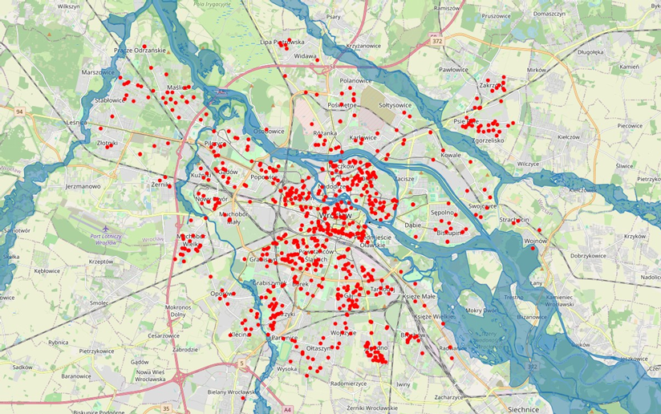
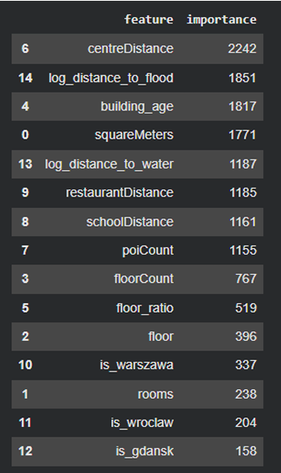
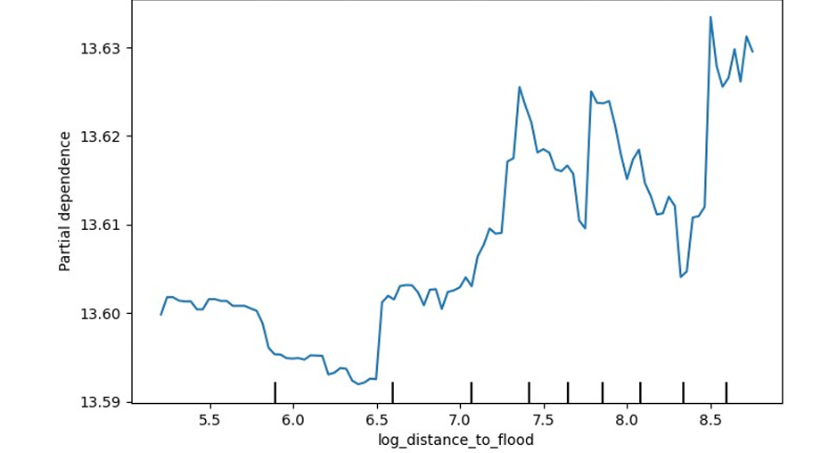

# Hybrid Machine Learning | Immobilienbewertung & Hochwasserrisikoanalyse

**Bachelorarbeit – Informatik**  
**Schwerpunkt: Künstliche Intelligenz & Data Science**

Entwicklung eines hybriden Systems zur Immobilienbewertung und Analyse des standortbezogenen Hochwasserrisikos.

Das Projekt integriert strukturierte Immobiliendaten mit Geodaten aus OpenStreetMap sowie offiziellen Hochwassergefahrenkarten ISOK (GUGiK). Ziel ist die automatische Bewertung von Immobilien unter Berücksichtigung klassischer Objektmerkmale und räumlicher Risikofaktoren.

---

## Projektübersicht

Das entwickelte System verarbeitet Daten aus drei Quellen:

- Apartment Prices in Poland (Kaggle)
- OpenStreetMap
- ISOK – Hochwassergefahrenkarten (GUGiK)

Während der Datenaufbereitung werden geopräumliche Merkmale erzeugt, darunter die Entfernung zu Gewässern sowie die Entfernung zu Hochwasserrisikozonen. Anschließend werden diese Merkmale mit den tabellarischen Immobiliendaten kombiniert und in einem LightGBM-Modell zur Vorhersage des Immobilienwertes verarbeitet. Die Ergebnisse werden in Power BI visualisiert. :contentReference[oaicite:3]{index=3}

---

## Verwendete Technologien

- Python
- pandas
- NumPy
- scikit-learn
- LightGBM
- GeoPandas
- Shapely
- OSMnx
- Matplotlib
- Seaborn
- Folium
- joblib
- Power BI

---

## Projektergebnisse

- 43.751 Immobilien aus Warschau, Breslau und Danzig
- Integration von Immobilien- und Geodaten
- Automatische Berechnung der Entfernung zu Gewässern
- Automatische Berechnung der Entfernung zu Hochwasserrisikozonen
- Vorhersage des Immobilienwertes mit LightGBM
- Interaktive Ergebnisdarstellung in Power BI

---

## Modellergebnisse

| Modell | R² |
|-------------------------------|------:|
| Dummy Regressor | -0.0002 |
| Lineare Regression | 0.7190 |
| Ridge Regression | 0.7247 |
| LightGBM | 0.8353 |
| **LightGBM + OSM + ISOK** | **0.8514** |

Die Erweiterung des Modells um Geodaten aus OpenStreetMap und ISOK führte zu einer Verbesserung der Vorhersagegenauigkeit. Die entwickelte Variable **log_distance_to_flood** belegte Platz 2 im Feature-Ranking und bestätigte den Einfluss des Hochwasserrisikos auf den Immobilienwert. :contentReference[oaicite:4]{index=4}

---

## 🖼️ Projektvorschau

### Entfernung zu Gewässern

---

### Immobilien in Hochwasserrisikozonen

---

### Ranking der wichtigsten Modellmerkmale

---

### Partial Dependence Plot

---

## Fazit

Im Rahmen der Arbeit wurde ein prototypisches System zur Immobilienbewertung und Bewertung standortbezogener Hochwasserrisiken entwickelt. Die Integration von OpenStreetMap- und ISOK-Daten verbesserte die Modellqualität und zeigte, dass räumliche Merkmale einen messbaren Einfluss auf die Vorhersage des Immobilienwertes haben. :contentReference[oaicite:5]{index=5}

---

## Datenquellen

- Apartment Prices in Poland (Kaggle)
- OpenStreetMap
- ISOK – Hochwassergefahrenkarten (GUGiK)

---

## Autor

**Katarzyna Brzeski**

Bachelorarbeit – Informatik

Vizja Universität Warschau
