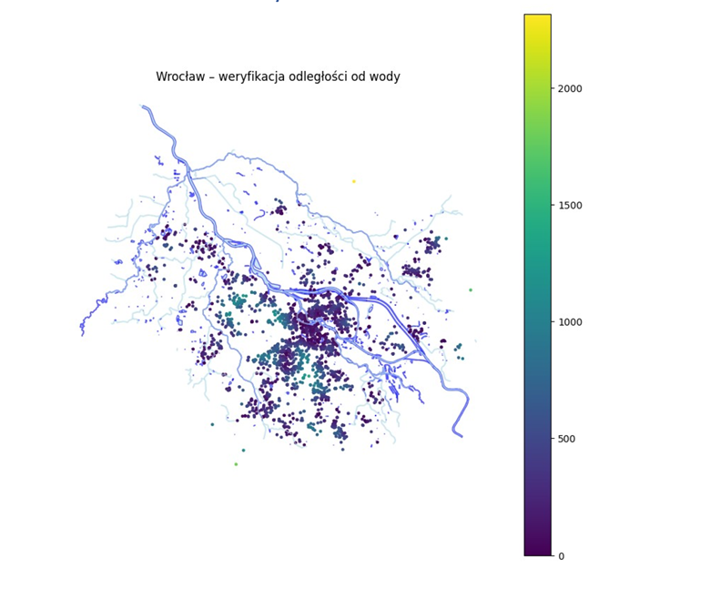

# Hybrid Machine Learning | Immobilienbewertung & Hochwasserrisikoanalyse

**Bachelorarbeit – Informatik**  
**Schwerpunkt: Künstliche Intelligenz & Data Science**

Hybrides Machine-Learning-System zur automatisierten Immobilienbewertung und Analyse standortbezogener Hochwasserrisiken.

Das Projekt kombiniert strukturierte Immobiliendaten mit amtlichen Hochwassergefahrenkarten (ISOK/GUGiK) sowie hydrografischen Daten aus OpenStreetMap. Ziel ist die objektive Bewertung von Immobilien unter Berücksichtigung klassischer Objekteigenschaften und standortbezogener Umweltfaktoren.

---

## Projektübersicht

Das System wurde als prototypische Entscheidungsunterstützung für Investoren und Marktanalysten entwickelt.

Im Mittelpunkt steht die Integration von:

- strukturierten Immobiliendaten
- amtlichen Hochwassergefahrenkarten (ISOK/GUGiK)
- hydrografischen Daten aus OpenStreetMap
- Geodatenanalyse
- Machine Learning

Die erzeugten räumlichen Merkmale werden gemeinsam mit den Immobiliendaten in einem LightGBM-Modell verarbeitet, um den Marktwert einer Immobilie vorherzusagen und gleichzeitig das standortbezogene Hochwasserrisiko zu bewerten.

---

## Verwendete Technologien

- Python
- pandas
- NumPy
- scikit-learn
- LightGBM
- GeoPandas
- Shapely
- OSMnx
- Matplotlib
- Seaborn
- Folium
- joblib
- Power BI

---

## Projektergebnisse

- Analyse von **43.751** eindeutigen Immobilien
- Integration von Immobilien- und Geodaten
- Automatische Berechnung der Entfernung zu Hochwasserzonen
- Automatische Berechnung der Entfernung zu Gewässern
- Vorhersage des Immobilienwertes mittels LightGBM
- Interaktive Visualisierung der Ergebnisse in Power BI

---

## Modellergebnisse

Vergleich der entwickelten Modelle:

| Modell | R² |
|--------|------:|
| Dummy Regressor | -0.0002 |
| Lineare Regression | 0.7190 |
| Ridge Regression | 0.7247 |
| LightGBM | 0.8353 |
| **LightGBM + OSM + ISOK** | **0.8514** |

Die Integration geographischer Merkmale führte zu einer messbaren Verbesserung der Vorhersagegenauigkeit.

---

## 🖼️ Projektvorschau

### Entfernung zu Gewässern

---

### Immobilien in Hochwasserrisikozonen

---

### Wichtigste Modellmerkmale

---

### Partial Dependence Plot

---

## Zentrale Erkenntnisse

- Geodaten verbessern die Genauigkeit der Immobilienbewertung.
- Die eigens entwickelte Variable **log_distance_to_flood** gehört zu den wichtigsten Einflussgrößen des Modells.
- Die Kombination aus OpenStreetMap-Daten und amtlichen ISOK-Hochwasserkarten ermöglicht eine automatische Bewertung standortbezogener Risiken.
- Das entwickelte System verbindet klassische Datenanalyse mit Geodatenanalyse in einer integrierten Machine-Learning-Pipeline.

---

## Datenquellen

- Apartment Prices in Poland (Kaggle)
- OpenStreetMap
- ISOK / GUGiK – Hochwassergefahrenkarten

---

## Autor

**Katarzyna Brzeski**

Bachelorarbeit – Informatik

Vizja Universität Warschau
